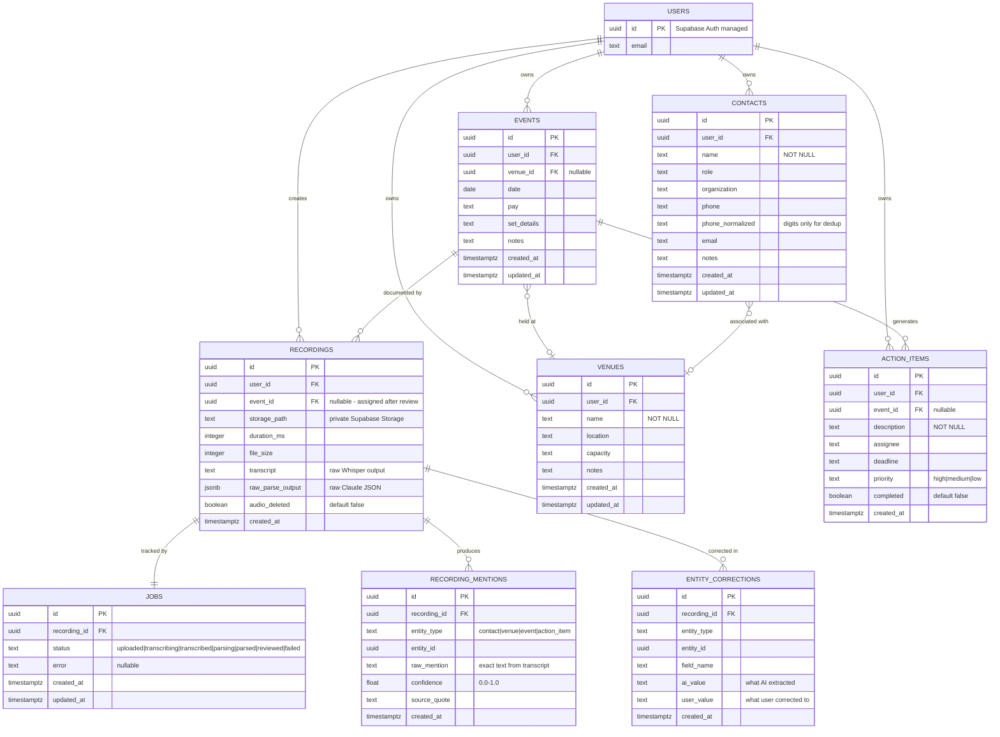

# PF-Intel V1: Voice-to-Structured-Data Pipeline

## Overview

A mobile-first venue intelligence app for Pacific Flow Entertainment. The owner records car debriefs after gigs on his phone. The app transcribes the audio (Whisper API), AI-parses it into structured venue/contact/event records (Claude), and presents an editable review screen for fast correction. Target: review a 5-minute debrief in under 2 minutes.

**Repo**: `pf-intel` (new monorepo, separate from `research-agent`)
**Stack**: Expo (React Native) frontend + Python FastAPI backend + Supabase (Postgres + Storage + Auth)

## Problem Statement

The owner tracks venue intel, contacts, and gig details in HoneyBook and his head. After every gig, he has observations — venue quirks, new contacts, follow-up items — that decay rapidly. Manual entry is slow enough that it doesn't happen. A voice-first pipeline converts stream-of-consciousness debriefs into structured, searchable records faster than manual entry.

## Architecture

```
PHONE (Expo)                         SERVER (FastAPI)
─────────────                        ────────────────
Record M4A (44.1kHz mono 64kbps) ───→  POST /audio/upload (HTTP 202)
                                           │
Queue offline (MMKV)                       ▼
                                      Save to Supabase Storage (private bucket)
                                           │
Poll GET /audio/{id}/status                ▼
                                      Whisper API (gpt-4o-mini-transcribe)
                                        - prompt with domain vocab
                                        - segment timestamps
                                           │
                                           ▼
                                      Quality check (hallucination detection)
                                           │
                                           ▼
                                      Claude API (structured outputs)
                                        - Pydantic schema
                                        - existing records context
                                        - confidence + source_quote
                                           │
                                           ▼
Review UI  ◄──────────────────────  Parsed data + transcript saved
  - Confidence-colored cards                │
  - Source quotes visible                   ▼
  - Phone numbers always flagged       Supabase Postgres
  - Accept/Edit/Dismiss per item         (venues, contacts, events,
  - Save All → Supabase                  recordings, jobs, mentions)
```

### Monorepo Structure

```
pf-intel/
├── app/                          # Expo (React Native)
│   ├── app.json
│   ├── eas.json
│   ├── package.json
│   ├── src/
│   │   ├── screens/
│   │   ├── components/
│   │   ├── lib/
│   │   │   ├── supabase.ts       # Supabase client + SecureStore adapter
│   │   │   ├── api.ts            # FastAPI client
│   │   │   └── queue.ts          # MMKV upload queue
│   │   └── hooks/
│   └── assets/
├── server/                       # Python FastAPI
│   ├── pf_intel/
│   │   ├── __init__.py
│   │   ├── main.py               # FastAPI app, lifespan, include_router
│   │   ├── config.py             # Pydantic BaseSettings
│   │   ├── dependencies.py       # get_supabase, get_current_user, get_settings
│   │   ├── errors.py             # Custom exception hierarchy
│   │   ├── routers/
│   │   │   ├── audio.py          # POST /audio/upload, GET /audio/{id}/status
│   │   │   ├── venues.py         # CRUD
│   │   │   ├── contacts.py       # CRUD
│   │   │   ├── events.py         # CRUD
│   │   │   └── health.py         # GET /health
│   │   ├── services/
│   │   │   ├── transcription.py  # Whisper API call
│   │   │   ├── parsing.py        # Claude structured output call
│   │   │   ├── pipeline.py       # Orchestrator: upload → transcribe → parse → store
│   │   │   └── storage.py        # Supabase Storage operations
│   │   └── schemas/
│   │       ├── audio.py          # Request/response models
│   │       └── extraction.py     # Pydantic models for parsed entities
│   ├── tests/
│   │   ├── conftest.py
│   │   └── ...
│   ├── pyproject.toml
│   ├── Dockerfile
│   └── .env.example
├── supabase/
│   └── migrations/               # SQL migration files (version controlled)
├── .gitignore
├── .pre-commit-config.yaml       # gitleaks hook
├── CLAUDE.md
└── README.md
```

## Data Model

### ERD



### Key Schema Decisions

- **`recording_mentions`**: Stores raw text mentions linked to parsed entities. Foundation for future entity resolution ("Sarah from LVL" across 3 debriefs = 1 contact).
- **`entity_corrections`**: AI value vs user correction. Gold for prompt improvement over time.
- **`jobs`**: Pipeline state machine with intermediate saves. If Whisper succeeds but Claude fails, the transcript is preserved.
- **`phone_normalized`**: Digits-only version alongside display format. Strongest dedup signal for future automated entity resolution.
- **`raw_parse_output`**: Full Claude JSON stored for debugging and prompt iteration. ~4 KB per debrief.
- **`pg_trgm`**: Trigram indexes on `contacts.name` and `venues.name` from day one. Costs nothing, enables future fuzzy matching.

## Technical Approach

### Voice Pipeline (Core)

1. **Recording**: `expo-audio` (NOT `expo-av` — deprecated SDK 53, removed SDK 55). Custom preset: 44.1kHz mono 64kbps M4A (Whisper resamples to 16kHz internally; recording at 44.1kHz preserves consonant clarity). ~0.5 MB/min, 15-min recording = ~7.5 MB. Well under Whisper's 25 MB limit.

2. **Upload**: Async pattern. `POST /audio/upload` returns HTTP 202 + `job_id`. Mobile polls `GET /audio/{job_id}/status` every 3-5 seconds. FastAPI BackgroundTasks runs the pipeline. Critical: `await file.read()` in the handler, pass `bytes` to the background task (UploadFile closes after response).

3. **Transcription**: OpenAI `gpt-4o-mini-transcribe` ($0.003/min). Prompt parameter with domain vocabulary: "Voice memo about music gigs. May mention venue names, contact names, phone numbers, song titles, set lists, sound equipment." Segment-level timestamps for source linking.

4. **Parsing**: Claude `claude-sonnet-4-20250514` with structured outputs. Pydantic schema with mandatory `confidence` (0.0-1.0) and `source_quote` fields on every entity. Pass existing contacts (last 90 days) as context to reduce duplicates.

5. **Review**: Confidence-colored cards (green >0.8, yellow 0.5-0.8, red <0.5). Phone numbers **always** flagged yellow/red regardless of AI confidence. Source quotes visible under every entity. "Accept All" per section for power users.

### Authentication

- **Supabase Auth** with email/password (single account)
- JWT tokens stored in `expo-secure-store` (NOT AsyncStorage — plain text)
- FastAPI validates JWT against Supabase's JWT secret
- RLS enabled on every table with `auth.uid() = user_id` policies
- Service role key server-side only, never in client code

### Offline Support

- Record to `FileSystem.documentDirectory` (persistent, not cleared by OS)
- Queue metadata in `react-native-mmkv` (synchronous, encrypted, requires dev build)
- `@react-native-community/netinfo` for connectivity detection (`isInternetReachable`, not just `isConnected`)
- TUS resumable uploads via `tus-js-client` for files > 6 MB (resume from failure point)
- `expo-background-task` as safety net (OS controls timing)

### Key Libraries

| Concern | Library | Notes |
|---------|---------|-------|
| Audio recording | `expo-audio` | SDK 53+ only. NOT expo-av |
| Auth tokens | `expo-secure-store` | Hardware-backed encryption |
| Queue persistence | `react-native-mmkv` | Requires dev build |
| Connectivity | `@react-native-community/netinfo` | Check isInternetReachable |
| Resumable upload | `tus-js-client` | For Supabase Storage TUS |
| Background tasks | `expo-background-task` | SDK 53+ |
| File system | `expo-file-system` | Use documentDirectory |
| Supabase client | `@supabase/supabase-js` | With SecureStore adapter |
| FastAPI config | `pydantic-settings` | Separate package since Pydantic v2 |
| Retry logic | `tenacity` | Exponential backoff with jitter |
| HTTP uploads | `python-multipart` | Required for FastAPI UploadFile |

## Implementation Phases

### Phase 1: Foundation (Sessions 1-3)

#### Session 1: Monorepo Scaffolding + Security Foundations

**Goal**: Empty repo with correct structure, security hooks, and both projects initialized.

**Deliverables**:
- [ ] `pf-intel/` repo initialized with git
- [ ] `.gitignore` with `.env`, `node_modules/`, `__pycache__/`, `.expo/`, `*.jks`, `*.keystore`
- [ ] `.pre-commit-config.yaml` with `gitleaks` hook installed and tested
- [ ] `server/pyproject.toml` with all dependencies (fastapi, uvicorn, pydantic-settings, supabase, openai, anthropic, python-multipart, tenacity, httpx)
- [ ] `server/pf_intel/__init__.py` + `server/pf_intel/errors.py` (custom exception hierarchy)
- [ ] `server/.env.example` with all required env vars documented
- [ ] `app/` initialized with `npx create-expo-app` (blank template)
- [ ] `npx expo install expo-dev-client` (NOT Expo Go — requires dev build)
- [ ] `eas.json` with `development`, `preview`, `production` build profiles
- [ ] `app.json` configured: `expo-audio` plugin with mic permission message, iOS `UIBackgroundModes: ["audio"]`
- [ ] `CLAUDE.md` for pf-intel repo (architecture overview, running instructions, conventions)
- [ ] Initial commit with all scaffolding

**Key patterns**:
- Mirror research-agent conventions: frozen dataclasses for config, custom exception hierarchy, single-concern files
- `gitleaks` pre-commit hook BEFORE any code with secrets exists

**Files touched**: ~15 new files (scaffolding)

---

#### Session 2: Supabase Schema + Auth + Storage

**Goal**: All database tables created with RLS, private storage bucket configured, single user account created.

**Deliverables**:
- [ ] Supabase project created (free tier for development)
- [ ] `supabase/migrations/001_initial_schema.sql` with all 8 tables:
  - `recordings`, `jobs`, `venues`, `contacts`, `events`, `action_items`, `recording_mentions`, `entity_corrections`
- [ ] `pg_trgm` extension enabled + trigram indexes on `contacts.name`, `venues.name`
- [ ] `phone_normalized` column on contacts
- [ ] `updated_at` trigger function on all tables with `updated_at` column
- [ ] RLS enabled on every table with `auth.uid() = user_id` policies for SELECT, INSERT, UPDATE, DELETE
- [ ] `user_id UUID REFERENCES auth.users(id)` on every data table
- [ ] Private storage bucket `recordings` created (not public, 50 MB file size limit, allowed MIME: `audio/mp4`, `audio/m4a`, `audio/mpeg`)
- [ ] Storage RLS: users can only upload/read from their own folder (`auth.uid()::text = (storage.foldername(name))[1]`)
- [ ] Single Supabase Auth user account created (email/password)
- [ ] SQL migration committed to repo

**Key patterns**:
- Run SQL in Supabase Dashboard SQL Editor, then save to `supabase/migrations/` for version control
- Test RLS from client SDK (not SQL editor, which bypasses RLS)
- Signed URLs with 60-second expiration for audio file access

**Files touched**: `supabase/migrations/001_initial_schema.sql`

---

#### Session 3: FastAPI Skeleton + Auth Middleware

**Goal**: Running FastAPI server with health check, Supabase client, JWT auth, and Dockerfile.

**Deliverables**:
- [ ] `server/pf_intel/config.py` — Pydantic BaseSettings with all env vars (supabase_url, supabase_key, supabase_service_key, anthropic_api_key, openai_api_key, environment, supabase_jwt_secret)
- [ ] `server/pf_intel/dependencies.py` — `get_settings()` (lru_cache), `get_supabase()` (singleton client), `get_current_user()` (JWT validation)
- [ ] `server/pf_intel/main.py` — FastAPI app with lifespan, include routers, stale job recovery on startup
- [ ] `server/pf_intel/routers/health.py` — `GET /health` returns status + timestamp + Supabase connectivity check
- [ ] JWT auth middleware: validate Authorization header against Supabase JWT secret, extract `user_id`
- [ ] Global error handler returning consistent `{error: true, status_code, message}` shape
- [ ] `server/Dockerfile` (Python 3.12-slim, non-root user, uvicorn CMD)
- [ ] `server/pf_intel/routers/__init__.py`, `server/pf_intel/services/__init__.py`, `server/pf_intel/schemas/__init__.py`
- [ ] Verify: `uvicorn pf_intel.main:app --reload` starts cleanly
- [ ] First test: `server/tests/test_health.py` (health endpoint returns 200)

**Key patterns**:
- Supabase client created ONCE (httpx client creation is slow). Singleton, not per-request.
- `docs_url=None, redoc_url=None` when `environment == "production"` (disable Swagger in prod)
- Router files contain only HTTP logic. Business logic in `services/`.

**Files touched**: ~8 new files in `server/`

---

### Phase 2: Voice Pipeline (Sessions 4-8)

#### Session 4: Phone Recording UI

**Goal**: Big red button. Tap to record, tap to stop. Duration timer. Multiple recordings per event.

**Deliverables**:
- [ ] `app/src/lib/supabase.ts` — Supabase client with `ExpoSecureStoreAdapter` for auth token persistence
- [ ] `app/src/screens/RecordScreen.tsx` — Main recording screen:
  - Big red record button (one-purpose screen, minimal UI)
  - Duration timer from `useAudioRecorderState`
  - Simple waveform from metering data
  - Stop button replaces record button during recording
  - Permission request on first tap (with denial handling → Settings redirect)
- [ ] Custom voice memo preset in `app/src/lib/audioPreset.ts`:
  ```
  16kHz, mono, 64kbps, M4A (.m4a extension)
  isMeteringEnabled: true
  ```
- [ ] Audio mode setup: `allowsRecording: true`, `playsInSilentMode: true`, `interruptionMode: 'doNotMix'`
- [ ] After stop: move file from temp to `FileSystem.documentDirectory/recordings/`
- [ ] Recording list grouped by date (shows pending recordings)
- [ ] Login screen (simple email/password → Supabase Auth → persist session)

**Key patterns**:
- `expo-audio` hooks API: `useAudioRecorder`, `useAudioRecorderState`
- `AudioModule.requestRecordingPermissionsAsync()` for mic permission
- iOS: `UIBackgroundModes: ["audio"]` already in app.json from Session 1
- Phone call interruption: save partial recording, offer to continue as new segment

**Files touched**: ~5 new files in `app/src/`

---

#### Session 5: Upload Endpoint + Async Pipeline

**Goal**: Phone uploads audio, server returns 202 immediately, phone polls for status.

**Deliverables**:
- [ ] `server/pf_intel/routers/audio.py`:
  - `POST /api/v1/audio/upload` — validates file type/size, reads bytes in handler (`await file.read()`), creates job record, starts BackgroundTasks, returns `{job_id, status: "processing"}` with HTTP 202
  - `GET /api/v1/audio/{job_id}/status` — returns current job status from jobs table
- [ ] `server/pf_intel/schemas/audio.py` — request/response Pydantic models (UploadResponse, JobStatus)
- [ ] `server/pf_intel/services/pipeline.py` — orchestrator skeleton:
  - Updates job status at each step (uploaded → transcribing → transcribed → parsing → parsed)
  - Saves intermediate results (transcript saved even if parsing fails)
  - Catches exceptions, marks job as `failed` with error message
  - Stores audio in Supabase Storage private bucket
- [ ] `server/pf_intel/services/storage.py` — upload to / download from / delete from Supabase Storage
- [ ] `app/src/lib/api.ts` — `uploadRecording()` and `pollJobStatus()` functions
- [ ] `app/src/screens/RecordScreen.tsx` updated: after recording stop, upload immediately if online; show upload progress; poll for status; navigate to review when parsed
- [ ] Stale job recovery in `main.py` lifespan (mark in-progress jobs as `failed_crash` on startup)

**Key patterns**:
- **CRITICAL**: `await file.read()` in endpoint handler, pass `bytes` to background task. Never pass `UploadFile` to BackgroundTasks (it closes after response).
- Max file size: 100 MB validation in endpoint
- Job status stored in Supabase `jobs` table (survives server crash for visibility)

**Files touched**: ~5 files in `server/`, 2 in `app/`

---

#### Session 6: Whisper Transcription Service

**Goal**: Audio bytes in, transcript out. Domain-aware prompting. Quality checks. Intermediate save.

**Deliverables**:
- [ ] `server/pf_intel/services/transcription.py`:
  - Call OpenAI `gpt-4o-mini-transcribe` with audio bytes
  - Domain vocabulary prompt: "Voice memo about music gigs. May mention venue names, contact names, phone numbers, song titles, set lists, sound equipment, and payment amounts."
  - Request segment-level timestamps (`timestamp_granularities=["segment"]`)
  - Retry with `tenacity`: 3 attempts, exponential backoff, retry on RateLimitError/APITimeoutError
  - Return transcript text + segments
- [ ] `server/pf_intel/services/quality.py` — transcript quality checks:
  - Detect repetitive hallucination (same 3-word phrase >3 times)
  - Detect known hallucination patterns ("thank you for watching", "please subscribe")
  - Compare word count to expected ~150 words/minute (flag if <50% expected)
  - Return quality warnings list
- [ ] Pipeline integration: after transcription, save raw transcript to `recordings.transcript`, update job status to `transcribed`
- [ ] Test: `server/tests/test_transcription.py` — mock OpenAI client, verify prompt parameter, verify retry behavior

**Key patterns**:
- `tenacity` retry: `stop_after_attempt(3)`, `wait_exponential(multiplier=1, min=1, max=30)`, `retry_if_exception_type((RateLimitError, APITimeoutError))`
- Transcript saved to DB immediately after Whisper returns (before Claude parsing). If Claude fails, transcript is preserved.

**Files touched**: 3 new files in `server/`

---

#### Session 7: Claude Parsing Service

**Goal**: Transcript in, structured entities out. Confidence scores. Source quotes. Recording mentions.

**Deliverables**:
- [ ] `server/pf_intel/schemas/extraction.py` — Pydantic models:
  - `ExtractedContact` (name, role, organization, phone, email, confidence, source_quote)
  - `ExtractedVenue` (name, location, capacity, notes, confidence, source_quote)
  - `ExtractedEvent` (venue, date, pay, set_details, notes, confidence, source_quote)
  - `ExtractedActionItem` (description, assignee, deadline, priority, confidence, source_quote)
  - `VoiceMemoExtraction` (contacts[], venues[], events[], action_items[], raw_notes, overall_summary)
- [ ] `server/pf_intel/services/parsing.py`:
  - Call Claude `claude-sonnet-4-20250514` with structured outputs
  - System prompt with critical rules: only extract explicitly stated info, source quotes mandatory, confidence scoring guidelines, phone number special handling
  - Pass existing contacts (last 90 days) as context in `<existing_records>` XML tags
  - XML boundaries around transcript (`<transcript>...</transcript>`) for prompt injection defense
  - Return validated `VoiceMemoExtraction`
- [ ] `server/pf_intel/services/validation.py` — post-extraction validation:
  - Flag phone numbers with unusual digit count (not 7, 10, or 11)
  - Override phone confidence to max 0.5 regardless of AI self-report
  - Flag low-confidence entities (<0.5)
  - Return warnings list
- [ ] Pipeline integration: after parsing, save `raw_parse_output` to `recordings.raw_parse_output`, create `recording_mentions` rows, update job status to `parsed`
- [ ] Test: `server/tests/test_parsing.py` — mock Anthropic client, verify schema, verify phone confidence override

**Key patterns**:
- Claude structured outputs with Pydantic schema (beta header: `anthropic-beta: structured-outputs-2025-11-13`)
- Phone numbers ALWAYS confidence <= 0.5 — Whisper + Claude is a two-step telephone game for digits
- Source quotes are mandatory anti-hallucination defense
- Store full raw Claude JSON in `recordings.raw_parse_output` for debugging

**Files touched**: 3 new files in `server/`

---

#### Session 8: Review/Correction UI

**Goal**: Editable summary screen with confidence-colored cards. Accept, edit, dismiss. Save to Supabase.

**Deliverables**:
- [ ] `app/src/screens/ReviewScreen.tsx` — main review screen:
  - Overall summary at top
  - Sections: CONTACTS, VENUES, EVENTS, ACTION ITEMS
  - Each entity as an editable card with confidence indicator:
    - Green checkmark (>0.8): pre-approved, tap to edit
    - Yellow warning (0.5-0.8): expanded by default, needs confirmation
    - Red flag (<0.5): must explicitly confirm or dismiss
    - Phone numbers: ALWAYS yellow/red regardless of AI confidence
  - Source quote visible under every entity (gray italic text)
  - "Accept All" checkbox per section
  - Tap card to open edit sheet with pre-filled fields
  - "View Full Transcript" expandable section
  - "Save All" and "Discard" buttons at bottom
- [ ] `app/src/components/EntityCard.tsx` — reusable confidence-colored entity card
- [ ] `app/src/components/EditSheet.tsx` — bottom sheet for editing entity fields (smart keyboard: numeric for phone, text for name with autocomplete from existing contacts)
- [ ] Save logic:
  - Insert/update records in `venues`, `contacts`, `events`, `action_items` tables
  - For each user correction: insert row in `entity_corrections` (ai_value, user_value)
  - Update job status to `reviewed`
  - `phone_normalized`: strip to digits-only when saving contacts
- [ ] Navigation: RecordScreen → (upload/poll) → ReviewScreen → (save) → success confirmation

**Key patterns**:
- Entity corrections tracked for prompt improvement: every field the user changes creates an `entity_corrections` row
- Phone numbers always flagged — hardcoded in the UI, not dependent on AI confidence
- Binary first, details second: tap "correct" or "edit", not a raw form
- Target: <2 minutes to review a 5-minute debrief

**Files touched**: ~4 new files in `app/src/`

---

### Phase 3: Data Access (Sessions 9-11)

#### Session 9: Venue List + Detail View

**Goal**: Browse and search saved venues.

**Deliverables**:
- [ ] `server/pf_intel/routers/venues.py` — `GET /api/v1/venues` (list with search query param), `GET /api/v1/venues/{id}` (detail with related events and contacts)
- [ ] `app/src/screens/VenueListScreen.tsx` — searchable list of venues (name, location, last event date)
- [ ] `app/src/screens/VenueDetailScreen.tsx` — full venue details + linked events + linked contacts + notes
- [ ] Tab navigation: Record | Venues | Contacts | Prep

**Files touched**: ~4 new files

---

#### Session 10: Contact List + Detail View

**Goal**: Browse and search saved contacts.

**Deliverables**:
- [ ] `server/pf_intel/routers/contacts.py` — `GET /api/v1/contacts` (list with search), `GET /api/v1/contacts/{id}` (detail with linked venues and events)
- [ ] `app/src/screens/ContactListScreen.tsx` — searchable list (name, role, organization)
- [ ] `app/src/screens/ContactDetailScreen.tsx` — full contact details + linked venues + linked events + history of recording mentions

**Files touched**: ~3 new files

---

#### Session 11: Gig Prep Briefing View

**Goal**: "Show me everything about [venue]" — composite briefing before a gig.

**Deliverables**:
- [ ] `server/pf_intel/routers/prep.py` — `GET /api/v1/prep/{venue_id}` returns composite: venue details + all contacts at that venue + past events + open action items + notes history
- [ ] `app/src/screens/PrepScreen.tsx` — briefing view:
  - Venue header (name, location, capacity)
  - Key contacts section (name, role, phone — tap to call)
  - Past events section (dates, pay, notes)
  - Open action items for this venue
  - "Last visited" date
- [ ] Prep tab in navigation: shows list of upcoming/recent venues, tap for briefing

**Files touched**: ~3 new files

---

### Phase 4: Reliability + Production (Sessions 12-14)

#### Session 12: Offline Recording Queue + Android Background Recording

**Goal**: Record without signal, upload when connectivity returns. Android keeps recording when backgrounded.

**Deliverables**:
- [ ] `app/src/lib/queue.ts` — MMKV-based upload queue:
  - `QueueItem` type: id, filePath, fileName, durationMs, createdAt, status (pending|uploading|failed|complete), retryCount, lastAttempt, fileSize, error
  - `enqueue()`, `dequeue()`, `updateStatus()`, `loadQueue()` (all synchronous)
  - Recovery on app startup: reset stale `uploading` items to `pending`
  - Max retry: 5 attempts with exponential backoff + jitter
  - Don't retry on 401/403/413/422 (not transient)
- [ ] Connectivity-triggered upload: `NetInfo.addEventListener` → when `isInternetReachable`, process queue
  - File < 6 MB: standard Supabase upload
  - File >= 6 MB: TUS resumable upload via `tus-js-client`
- [ ] Upload progress UI: badge showing "3 recordings waiting to upload" / "Uploading 1 of 3..." / per-item progress
- [ ] Queue limits: warn at 500 MB total queued, hard limit at 1 GB
- [ ] `expo-background-task` registration as safety net for background upload attempts
- [ ] Android foreground service setup:
  - `@notifee/react-native` for persistent notification during recording
  - Android permissions: `RECORD_AUDIO`, `FOREGROUND_SERVICE`
  - Config plugin in `app.json`
- [ ] Device storage check before recording (`FileSystem.getFreeDiskStorageAsync()` — warn <50 MB, block <20 MB)
- [ ] Delete local audio files after confirmed upload

**Key patterns**:
- MMKV is synchronous — no async/await needed for queue operations
- TUS upload resumes from failure point (critical for cellular)
- `isInternetReachable` not just `isConnected` (can be on WiFi with no internet)
- Background tasks are a safety net, not primary upload mechanism

**Files touched**: ~4 files in `app/src/`

---

#### Session 13: Manual Entry Forms

**Goal**: Fallback data entry for venues, contacts, events when not using voice.

**Deliverables**:
- [ ] `server/pf_intel/routers/venues.py` updated: `POST /api/v1/venues`, `PUT /api/v1/venues/{id}`
- [ ] `server/pf_intel/routers/contacts.py` updated: `POST /api/v1/contacts`, `PUT /api/v1/contacts/{id}`
- [ ] `server/pf_intel/routers/events.py` — `GET /api/v1/events`, `POST /api/v1/events`, `PUT /api/v1/events/{id}`
- [ ] `app/src/screens/VenueFormScreen.tsx` — create/edit venue
- [ ] `app/src/screens/ContactFormScreen.tsx` — create/edit contact
- [ ] `app/src/screens/EventFormScreen.tsx` — create/edit event (venue picker, contact linker)
- [ ] "Add" button on list screens → form screen
- [ ] "Edit" button on detail screens → form screen pre-filled

**Files touched**: ~6 files

---

#### Session 14: Production Hardening

**Goal**: Error monitoring, spending limits, privacy policy, production build.

**Deliverables**:
- [ ] Sentry setup — FastAPI:
  - `sentry-sdk[fastapi]` in pyproject.toml
  - `sentry_sdk.init(dsn=..., traces_sample_rate=0.1, send_default_pii=False)`
  - **CRITICAL**: `send_default_pii=False` — no contact names/phones in Sentry
- [ ] Sentry setup — Expo:
  - `@sentry/react-native` + `sentry-expo` plugin
  - Same: no PII in error reports
- [ ] Spending limits configured:
  - OpenAI: $10/month hard cap
  - Anthropic: $10/month hard cap
  - Billing alerts at 50% and 80%
- [ ] Privacy policy: simple plain-English document hosted at a URL (what data is collected, where stored, third-party processors, retention, deletion)
- [ ] Recording screen disclaimer: "Record your own observations only. Do not record conversations with others without their consent."
- [ ] FastAPI production config: `docs_url=None, redoc_url=None` when `ENVIRONMENT=production`
- [ ] Audio cleanup: cron/scheduled job to delete audio files from Supabase Storage 7 days after successful transcription
- [ ] Rate limiting: `slowapi` on upload endpoint (10/hour)
- [ ] UptimeRobot (free tier) monitoring `/health` endpoint every 5 minutes
- [ ] Production Expo build: `eas build --profile production`
- [ ] Deploy FastAPI to Railway (connect GitHub repo, set env vars, configure health check path)

**Key patterns**:
- Never log PII (transcripts, names, phone numbers) in production
- Supabase: upgrade to Pro ($25/month) before production for automatic daily backups
- Remove all `console.log` with sensitive data from Expo app
- Verify RLS works from client SDK (not SQL editor)

**Files touched**: ~5 files across both `app/` and `server/`

---

## Acceptance Criteria

### Functional Requirements

- [ ] Record a 5-minute voice memo on phone, upload, and see structured data extracted in <3 minutes total pipeline time
- [ ] Review screen shows all extracted entities with confidence indicators and source quotes
- [ ] User can edit any extracted field and save corrections
- [ ] Phone numbers are always flagged for manual review regardless of AI confidence
- [ ] Saved data appears in venue/contact/event list views
- [ ] Gig prep view shows composite briefing for a venue
- [ ] Recordings queue locally when offline and upload when connectivity returns
- [ ] Multiple recordings can be grouped under one event
- [ ] Manual entry forms work as fallback for all entity types

### Non-Functional Requirements

- [ ] All endpoints require JWT authentication
- [ ] RLS enabled and tested on every Supabase table
- [ ] Audio files in private bucket with signed URLs only
- [ ] No PII in server logs or Sentry
- [ ] Spending limits on all AI API accounts
- [ ] gitleaks pre-commit hook prevents secret commits
- [ ] Health check endpoint responds in <1 second

## Cost Summary

| Service | Monthly Cost |
|---------|-------------|
| OpenAI Whisper API (gpt-4o-mini-transcribe) | ~$0.15 |
| Anthropic Claude API (parsing) | ~$0.20 |
| Railway/Render hosting | $5-7 |
| Supabase Pro (with backups) | $25 |
| Sentry (free tier) | $0 |
| UptimeRobot (free tier) | $0 |
| **Total** | **~$31-34/month** |

## Risk Analysis

| Risk | Likelihood | Impact | Mitigation |
|------|-----------|--------|------------|
| Voice parsing misses/invents entities | High | Medium | Source quotes mandatory, confidence scoring, phone always-flagged, review UI catches errors before save |
| Whisper mishears phone numbers | Very High | Medium | Phone numbers always flagged for review regardless of confidence |
| Car audio (road noise) degrades transcription | Medium | Medium | Domain vocabulary prompt, test with real car recordings in Session 6 |
| Android background recording fails | Medium | High | Foreground service via @notifee/react-native, test on real Android early |
| API key committed to git | Low | Critical | gitleaks pre-commit hook installed before first code |
| Upload fails on slow cellular | High | Low | TUS resumable upload, offline queue, retry with backoff |
| Claude API down during pipeline | Low | Medium | Intermediate saves (transcript preserved), retry logic, user notification |
| expo-audio 25-min recording cap (inherited from expo-av?) | Unknown | Medium | Test 30-min recording early, set 20-min soft cap in UI |

---

## Enhancement Summary

**Deepened on:** 2026-02-16
**Research agents used:** Architecture Strategist, Security Sentinel, Performance Oracle, Data Integrity Guardian, Spec Flow Analyzer, FastAPI Async Pipeline, Supabase Auth+RLS+Storage, Claude Structured Outputs, Whisper Transcription, Expo Audio + Offline Queue
**Institutional learnings applied:** 7 (from docs/solutions/)

### Critical Corrections (must fix before Session 1)

1. **Token storage**: `expo-secure-store` has a 2048-byte limit — Supabase JWTs exceed this. Use `expo-sqlite`/`localStorage` polyfill or `LargeSecureStore` with AES encryption instead.
2. **JWT library**: `python-jose` is deprecated since 2021. Use `PyJWT` instead.
3. **Claude structured outputs**: Now GA — no beta header needed. Use `client.messages.parse()` with Pydantic models directly.
4. **Audio sample rate**: Record at 44100 Hz (device default), not 16 kHz. Whisper resamples internally. AAC at 16 kHz caps at ~8 kHz frequency, losing consonant clarity. File size is controlled by bitrate (64 kbps), not sample rate.
5. **Max upload size**: Whisper API limit is 25 MB, not 100 MB. Enforce on both client and server.

### Key Decisions Updated

| Decision | Original Choice | Updated Choice | Why |
|----------|----------------|----------------|-----|
| Token storage | expo-secure-store | expo-sqlite polyfill or LargeSecureStore | 2048-byte limit too small for JWTs |
| JWT library | python-jose | PyJWT | python-jose deprecated since 2021 |
| Claude API | Beta structured outputs | GA `client.messages.parse()` | No beta header needed, stable API |
| Sample rate | 16 kHz | 44100 Hz (device default) | Better quality, Whisper resamples internally |
| Status updates | Polling only | Consider Supabase Realtime subscriptions | Instant push vs 3-5s polling delay |
| Whisper model | gpt-4o-mini-transcribe | gpt-4o-mini-transcribe-2025-12-15 (pinned) | Pin snapshot for reproducibility, 89% fewer hallucinations vs whisper-1 |

---

## Research Insights by Domain

### Schema & Data Integrity (Session 2 Fixes)

**Source:** Data Integrity Guardian, Architecture Strategist

**Critical fixes for initial migration:**

- **Add ON DELETE CASCADE** for required FKs (e.g., recording → jobs), **SET NULL** for optional FKs
- **Replace polymorphic `entity_id`** (entity_type + entity_id pattern has no FK integrity) with separate nullable FK columns + CHECK constraint:
  ```sql
  -- Instead of: entity_type TEXT + entity_id UUID (no FK possible)
  -- Use: separate nullable FKs with a CHECK constraint
  venue_id UUID REFERENCES venues(id) ON DELETE CASCADE,
  contact_id UUID REFERENCES contacts(id) ON DELETE CASCADE,
  event_id UUID REFERENCES events(id) ON DELETE CASCADE,
  CHECK (
    (venue_id IS NOT NULL)::int +
    (contact_id IS NOT NULL)::int +
    (event_id IS NOT NULL)::int = 1
  )
  ```
- **Add `user_id`** to `recording_mentions`, `entity_corrections`, and `jobs` tables (required for RLS policies)
- **Add CHECK constraint** on `jobs.status` enum — include `'failed_crash'` for unrecoverable failures
- **Add CHECK** on `action_items.priority` (1-5 range), `recording_mentions.confidence` (0.0-1.0 range)
- **Add `updated_at`** to `recordings` and `action_items` tables (missing from current schema)
- **Add `venue_id` FK** to `contacts` table (ERD shows relationship but schema doesn't implement it)
- **Phone normalization** via DB trigger, not just application code (ensures consistency regardless of entry point)
- **Add `correction_type`** and `ai_confidence`** to `entity_corrections` table (track what was corrected and original AI confidence)
- **Write rollback script** for initial migration (Session 2 deliverable)

**Job state machine transition validation:**
```python
VALID_TRANSITIONS = {
    "pending": {"transcribing"},
    "transcribing": {"transcribed", "failed"},
    "transcribed": {"parsing"},
    "parsing": {"parsed", "failed"},
    "parsed": {"review_ready"},
    "review_ready": {"completed"},
    "failed": {"pending"},  # retry
}
```
Enforce at application level + CHECK constraint in DB.

### Backend: FastAPI Pipeline (Sessions 3, 5, 7 Fixes)

**Source:** FastAPI Research, Security Sentinel, Performance Oracle, Institutional Learnings

**Critical:**
- **`await file.read()` in handler, pass bytes to BackgroundTask**: `UploadFile` closes after response — if BackgroundTask reads the file later, it gets empty bytes
  ```python
  @router.post("/audio/upload")
  async def upload_audio(file: UploadFile):
      content = await file.read()  # Read BEFORE response
      background_tasks.add_task(process_pipeline, content, ...)
      return JSONResponse(status_code=202, content={"job_id": job_id})
  ```
- **Add `sanitize_content()`** to transcript before Claude parsing (3-layer prompt injection defense from research-agent learnings)
- **Add atomic save endpoint** for review: `POST /api/v1/recordings/{id}/review` wrapping all entity saves in a DB transaction
- **Add pipeline retry endpoint**: `POST /api/v1/audio/{job_id}/retry` (currently no way to retry from mobile)
- **Add upload idempotency key**: `X-Idempotency-Key` header to prevent duplicate processing on network retry
- **Add IDOR protection**: Filter by `user_id` on every query (even single-user V1 — prevents future bugs)
- **Safe error messages**: Map exceptions to user-friendly strings. Never expose `str(e)` to clients
- **Validate file magic bytes**, not just `Content-Type` header (can be spoofed)
- **Add structured logging in Session 3** (not Session 14 — need it for pipeline debugging from day one)

**Performance:**
- **Adaptive batch backoff** (from `docs/solutions/performance-issues/adaptive-batch-backoff.md`): Don't add fixed delays between API calls. Use boolean flag that only sleeps after actual 429
- **Pre-process transcripts**: Normalize spoken numbers to digits (use `text2digits` library), remove filler words before Claude parsing — reduces token count and parsing errors

**Confidence scoring:**
- Self-reported LLM confidence is unreliable. Use **prompted calibration rules** in the system prompt + **post-hoc programmatic adjustment**:
  - Phone numbers: always cap at 0.6 regardless of Claude's self-report
  - Names not in existing contacts: cap at 0.7
  - Dollar amounts: cap at 0.8 (spoken numbers are error-prone)

### Frontend: Expo + React Native (Sessions 4, 8, 12 Fixes)

**Source:** Expo Audio Research, Supabase Research, Spec Flow Analyzer

**Auth & Storage:**
- **expo-secure-store 2048-byte JWT problem**: Use `expo-sqlite` or `@react-native-async-storage/async-storage` as polyfill. Or implement `LargeSecureStore` that AES-encrypts with a key stored in secure-store
- **Add `AppState` listener** for auth token refresh:
  ```typescript
  import { AppState } from 'react-native'
  AppState.addEventListener('change', (state) => {
    if (state === 'active') supabase.auth.startAutoRefresh()
    else supabase.auth.stopAutoRefresh()
  })
  ```

**Recording:**
- **expo-audio (NOT expo-av)**: expo-av deprecated SDK 53, removed SDK 55. Use `useAudioRecorder` hook
- **Dev builds required** for MMKV and expo-audio — Expo Go doesn't support native modules
- **Add 20-minute recording soft cap** with warning toast
- **Cap waveform visualization** to sliding window of 300 bars (prevent memory issues on long recordings)

**Upload & Status:**
- **TUS chunk size must be exactly 6 MB** for Supabase Storage
- **Throttle TUS progress callbacks** to 500ms (prevent excessive re-renders)
- **Consider Supabase Realtime subscriptions** instead of polling for job status — instant push vs 3-5s delay:
  ```typescript
  supabase.channel('job-status')
    .on('postgres_changes', {
      event: 'UPDATE',
      schema: 'public',
      table: 'jobs',
      filter: `id=eq.${jobId}`
    }, (payload) => setStatus(payload.new.status))
    .subscribe()
  ```
- **Add client-side polling timeout**: 5 minutes with "Still processing — retry?" prompt
- **Move device storage check** from Session 12 to Session 4 (fail fast before first recording)

**Review Screen:**
- **Use ScrollView (not FlatList)** for review screen (~12 items max — FlatList virtualization overhead not needed)
- **Add empty states** on ALL screens (no recordings, no results, pipeline empty)

**Expo Audio Gotchas** (from Expo Audio Research Agent):
- **`interruptionModeAndroid` is separate from `interruptionMode`** — known bug [#34025](https://github.com/expo/expo/issues/34025). Set both in `setAudioModeAsync()`
- **Phone call interrupts recording on iOS** — recording stops, does NOT auto-resume. Treat as save point: save partial recording, queue it, let user start a new one. Do NOT try to resume mid-file (causes corruption)
- **M4A moov atom crash risk** — if app crashes before `recorder.stop()`, the .m4a file may be unplayable. Save recording metadata to MMKV when recording starts; on next launch, check for orphaned files
- **Built-in RecordingPresets are wrong for voice** — both HIGH_QUALITY and LOW_QUALITY use stereo. LOW_QUALITY uses AMR_NB on Android. Must use custom preset (mono AAC)
- **Metering may not update** on expo-audio <0.4.8 ([#37241](https://github.com/expo/expo/issues/37241)). Ensure `isMeteringEnabled: true` in preset and SDK 53.0.9+
- **Android `getFreeDiskStorageAsync` bug** — returns `Number.MAX_SAFE_INTEGER` on some devices ([#6945](https://github.com/expo/expo/issues/6945)). Guard: if `freeMB > totalMB`, treat as unlimited
- **NetInfo `isInternetReachable` starts as `null` on iOS** — must handle 3 states (true/false/null), not just truthy/falsy
- **tus-js-client expects Blob, not file URI** — must convert via `fetch(fileUri).then(r => r.blob())`. If that throws on some devices, fall back to base64 conversion via `expo-file-system`
- **expo-background-task replaces expo-background-fetch** in SDK 53+ — uses BGTaskScheduler (iOS) / WorkManager (Android). ~30s execution window. Background tasks are a safety net, not primary upload trigger
- **Queue size cap**: Add 500 MB max to prevent unbounded growth during extended offline periods
- **Notifee config plugin required** for Expo managed workflow — must add `FOREGROUND_SERVICE_MICROPHONE` permission and `tools:replace` attribute to avoid manifest merge conflicts ([#1108](https://github.com/invertase/notifee/issues/1108))

### Security Fixes

**Source:** Security Sentinel, Institutional Learnings

**Critical:**
- **Brainstorm doc contradiction**: `fastapi-supabase-voice-pipeline.md` mentions static API key auth, which contradicts the plan's JWT auth. Annotate the brainstorm doc to clarify JWT is the chosen approach
- **JWT refresh token rotation** strategy needed — current plan doesn't address token refresh
- **CORS configuration**: Use explicit allowed origins, never `*` wildcards
- **Add `pip-audit`** to pre-commit hooks (catch vulnerable dependencies early)
- **Rate limiting on ALL endpoints**, not just upload (prevent enumeration attacks)
- **Storage RLS**: Use private buckets with `storage.foldername(name)` function for path-based RLS:
  ```sql
  CREATE POLICY "Users access own audio"
  ON storage.objects FOR ALL
  USING (bucket_id = 'recordings' AND storage.foldername(name) = (SELECT auth.uid()::text));
  ```

**RLS query optimization** (from Supabase research):
```sql
-- BAD: auth.uid() called per row
WHERE user_id = auth.uid()

-- GOOD: subquery evaluated once, cached by planner
WHERE user_id = (SELECT auth.uid()::text)
```

### UX & Flow Gaps

**Source:** Spec Flow Analyzer (14 user flows mapped)

**Missing flows that need session assignment:**

| Gap | Recommendation | Session |
|-----|---------------|---------|
| Multi-recording per event | Explicitly defer to V2 with note in data model | Session 2 (note) |
| No delete flow anywhere | Add DELETE endpoints + swipe-to-delete in list views | Session 9 |
| No pipeline retry from mobile | Add retry button on failed status screen | Session 8 |
| No "pending reviews" state on app reopen | Check for in-progress jobs on app foreground | Session 8 |
| No offline handling for Browse/Prep screens | Show cached data + "offline" banner | Session 12 |
| Post-review navigation unspecified | Navigate to entity detail or recording list | Session 8 |
| "Discard" behavior undefined | Delete job + audio file, confirm dialog | Session 8 |
| Recording disclaimer placement | Show on first launch, not every recording | Session 4 |
| Events list/detail screen missing | Add basic events CRUD in browse flow | Session 9 |
| Action items list screen missing | Add action items view with due date sorting | Session 9 |

### Whisper Transcription Insights

**Source:** Whisper Research Agent

**Model recommendation**: `gpt-4o-mini-transcribe-2025-12-15` (pinned snapshot)
- 89% fewer hallucinations vs `whisper-1`
- $0.003/min ($0.15/month at 50 min)
- Does NOT support `verbose_json` or timestamps — add `whisper-1` only if audio-playback-per-entity needed in V2

**Domain vocabulary prompt** (high ROI, zero cost):
```python
DOMAIN_PROMPT = (
    "Voice memo after a music gig. "
    "Venues: The Blue Note, Mohawk, Stubb's BBQ, The Continental Club, "
    "Antone's, Hotel Vegas, Empire Control Room, Cheer Up Charlies, The Parish. "
    "Contacts: Sarah Chen, Dave Rodriguez, Mike Thompson. "
    "Music terms: set list, monitor mix, sound check, green room, "
    "load-in, load-out, backline, DI box, in-ear monitors. "
    "Phone numbers: 512-555-0142, 737-555-0198."
)
```

**Hallucination detection** (add to pipeline quality check):
- Check for known hallucination phrases ("thank you for watching", "subscribe", etc.)
- Detect repetitive 3-grams (4+ repetitions = hallucination signal)
- Validate word count vs audio duration (80-200 words/min expected range)
- `gpt-4o-mini-transcribe` supports `logprobs` for token-level confidence

**Phone number handling**:
- Three-layer defense: prompt with examples → regex extraction → always flag for review
- Phone confidence always capped at 0.6 regardless of Claude's self-report
- Consider `text2digits` library for spoken-word number normalization

**Audio settings corrected**:
- Record at **44100 Hz** (not 16 kHz) — device default, better quality
- Do NOT apply traditional denoising (hurts Whisper more than helps)
- Normalize audio levels + trim leading/trailing silence before upload

### Session Structure Recommendations

**Source:** Architecture Strategist, Performance Oracle

- **Split Session 12** into:
  - **12a**: MMKV queue + connectivity detection + auto-upload on reconnect
  - **12b**: TUS resumable upload + Android foreground service + storage checks
- **Move device storage check** from Session 12 → Session 4 (fail fast)
- **Move structured logging** from Session 14 → Session 3 (need for pipeline debugging)
- **Consider deferring TUS** to V2: standard upload + retry may suffice for 7 MB files on cellular. TUS adds significant complexity for marginal benefit at this file size.

### Institutional Learnings Applied

From `docs/solutions/` (research-agent project):

1. **Validation ownership** (`pip-installable-package-and-public-api.md`): Don't duplicate valid values across files. For modes/status enums, define once and delegate validation to the owning module.
2. **Structured returns** (`agent-native-return-structured-data.md`): Return typed objects from day one. Every API endpoint should return structured data with metadata, not raw strings.
3. **Model string unification** (`model-string-unification.md`): Centralize model strings (Whisper model, Claude model) in a single config object. Don't scatter across modules.
4. **Adaptive batch backoff** (`adaptive-batch-backoff.md`): No fixed delays between API calls. React to actual 429s.
5. **Exception hierarchy** (`dead-catch-and-narrow-httpx-exceptions.md`): Use `httpx.TransportError` parent class, not individual transport exceptions. Check inheritance before ordering catch clauses.
6. **SSRF via proxy** (`ssrf-bypass-via-proxy-services.md`): Every URL-touching code path needs validation — applies to Jina Reader / content extraction if added later.
7. **Adversarial verification** (`adversarial-verification-pipeline.md`): Draft → Skeptic → Final pattern. Consider for V2 extraction verification when accuracy requirements increase.

### Supabase-Specific Gotchas

**Source:** Supabase Research Agent

- **Free tier pauses after 7 days inactivity** — no backups on free tier. Set up pg_dump cron or upgrade early.
- **`supabase.auth.getSession()` warning**: Returns from local storage, may be stale. Use `supabase.auth.getUser()` for server-side validation.
- **RLS on storage**: Use private buckets. Public buckets bypass RLS entirely.
- **Realtime subscriptions**: Enable in Supabase dashboard per-table. Disabled by default.
- **`(SELECT auth.uid()::text)` optimization**: Wrapping in subquery prevents per-row function evaluation in RLS policies.

---

## References

### Research Documents (Full Details)

1. [Voice-to-Structured-Data Pipeline](../brainstorms/2026-02-16-voice-to-structured-data-research.md) — Whisper API, Claude parsing, prompt engineering, HITL review patterns
2. [Expo Audio + Offline Queue](../brainstorms/2026-02-16-expo-audio-offline-queue-research.md) — expo-audio, MMKV, TUS uploads, background recording, NetInfo
3. [FastAPI + Supabase Architecture](../brainstorms/2026-02-16-fastapi-supabase-voice-pipeline.md) — Project structure, async pipeline, deployment, Supabase integration
4. [Security, Privacy, Production Readiness](../brainstorms/2026-02-16-pf-intel-security-research.md) — Auth, RLS, storage security, API key safety, compliance, monitoring

### Institutional Learnings (from research-agent)

- `docs/solutions/architecture/agent-native-return-structured-data.md` — Return structured data with metadata, confidence, gate_status
- `docs/solutions/architecture/pip-installable-package-and-public-api.md` — Validation ownership, additive migration pattern
- `docs/solutions/security/ssrf-bypass-via-proxy-services.md` — Validate URLs before proxy forwarding
- `docs/solutions/logic-errors/adversarial-verification-pipeline.md` — Draft → Skeptic → Final pattern for extraction verification
- `docs/solutions/architecture/model-string-unification.md` — Centralize model strings in one place

### Key Decisions Log

| Decision | Choice | Why | Alternative Rejected |
|----------|--------|-----|---------------------|
| Build order | Voice pipeline first | Riskiest assumption (AI parsing accuracy) must be tested before forms/search | Database + forms first (delays testing core value prop) |
| Whisper | OpenAI API (gpt-4o-mini-transcribe) | $0.15/month vs $276/month self-hosted. 1000x under break-even. | Self-hosted Whisper (overkill at this volume) |
| Audio library | expo-audio | expo-av deprecated SDK 53, removed SDK 55 | expo-av (deprecated) |
| Upload pattern | Async (HTTP 202 + polling) | Pipeline takes 35-105 seconds, exceeds HTTP timeouts | Synchronous (times out) |
| Auth | Supabase Auth (email/password) | JWT + RLS built-in, secure, single account | Static API key (if leaked, no revocation) |
| Token storage | ~~expo-secure-store~~ → expo-sqlite polyfill | 2048-byte limit too small for JWTs (see Enhancement Summary) | AsyncStorage (plain text on filesystem) |
| Queue persistence | react-native-mmkv | Synchronous, 30x faster than AsyncStorage, encrypted | AsyncStorage (slow, no encryption, async) |
| Parse approach | One-pass Claude with structured outputs | Sufficient for 3-15 min single-speaker memos | Two-pass (only needed for 30+ min or multi-speaker) |
| Background tasks | FastAPI BackgroundTasks | 8-10 requests/month, Celery is overkill | Celery + Redis (massive overhead for this volume) |
| Hosting | Railway (prototype) → Render (production) | Auto-deploy from git, beginner-friendly, ~$5-7/month | Fly.io (harder setup) |
| Duplicate detection | Deferred (V2) | Entity resolution is hard, need real data first | Automated (premature without training data) |
