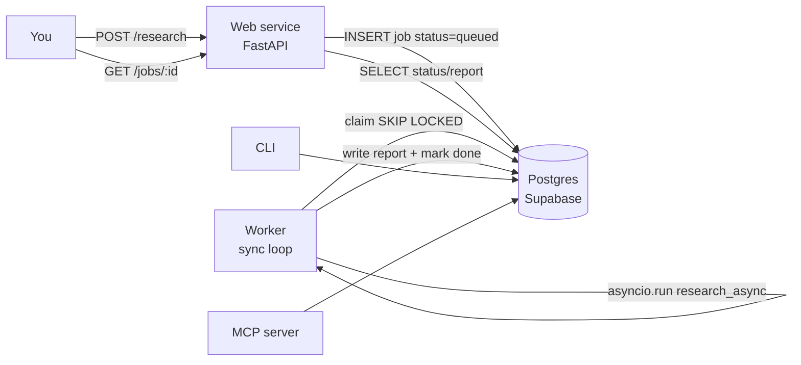
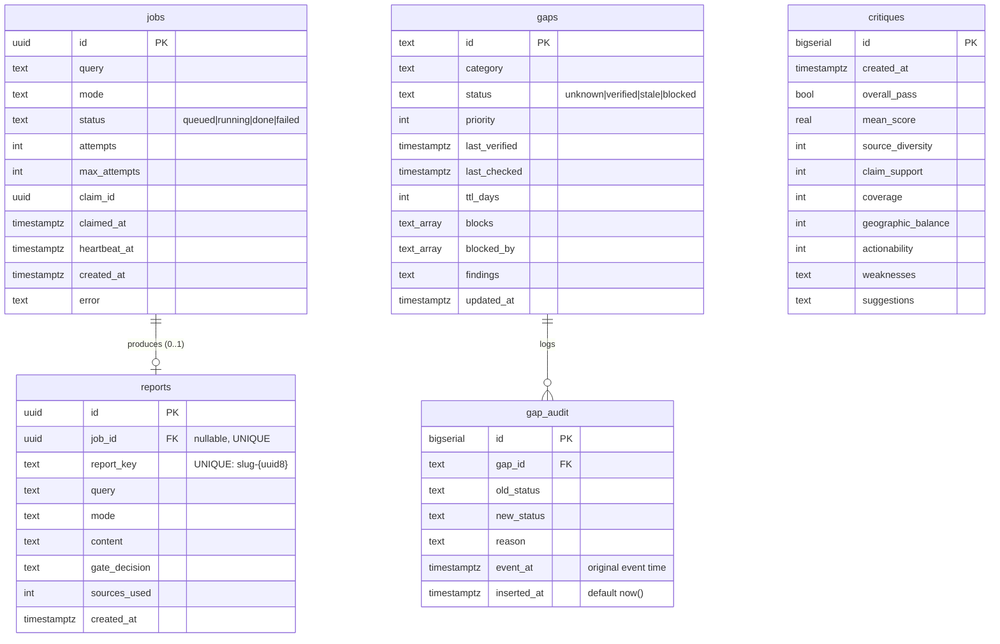

# Headless Service Core (Internal Tool — Phase A)

## Prior Phase Risk

From the brainstorm's Three Questions — "Least confident going into planning":

> "The storage migration's blast radius on the gap-schema state machine and the test suite — the plan must inventory every file-path assumption before code starts."

**How this plan addresses it:** A complete call-site inventory was built from a symbol grep plus three research agents (repo recon, past-lessons, spec-flow). Two findings de-risk it directly: (1) the gap **state machine is pure code** (`mark_verified`, `mark_checked`, `detect_stale`, `select_batch`, `_parse_gap`) and does **not** change — only the ~7 I/O functions move; (2) storage tests are already `tmp_path`-parameterized with explicit paths passed in, so they port to a DB fixture cleanly (~120–140 of 1,109 tests; ~970 are pure/API-mocked and untouched). Session 2 proves the state machine against Postgres **before** the rest cuts over (`verify_first: true`).

## Enhancement Summary

**Deepened on:** 2026-07-21 via 5 parallel research agents (Postgres-queue, psycopg3, pytest fixtures, FastAPI, Railway) against current (2026) docs. Decisions/EARS/sessions/confidence unchanged; depth added. See **Implementation Notes (deepened research)** below.

### Key improvements folded in
1. **Heartbeat-decoupled lease** — worker heartbeats ~15–30s; reaper lease (~90s) need only exceed the heartbeat interval, covering jobs of any length. Adds `claim_id` (uuid) + `heartbeat_at`.
2. **Pooler mode RESOLVED to session (5432), not transaction (6543)** — a cross-agent conflict; session mode is IPv4-safe from Railway (direct host is IPv6-only), prepared statements work, one user won't exhaust it. Drops the `prepare_threshold=None` workaround.
3. **Storage functions take an injected `conn`** (caller owns the transaction) — enables rollback-per-test isolation; matches the "pass paths as args" style. Highest-leverage refactor.
4. **FastAPI routes are plain `def`** (auto-threadpooled) calling sync psycopg directly; `lifespan` pool; liveness-only `/health`.
5. **Two Railway services + two config files**; worker gets NO healthcheck; migrations via `preDeployCommand` on web only.
6. **Test strategy:** rollback-per-test for logic; committed+TRUNCATE (or schema-per-worker) for SKIP-LOCKED concurrency; real Docker/testcontainers Postgres, never SQLite.

### New considerations discovered
- `psycopg_pool` is a separate install (`psycopg[binary,pool]`), needs explicit `open=True`/`.open()`.
- Increment `attempts` at CLAIM (not requeue) so poison jobs hit their cap; `claim_id` + `UNIQUE(job_id)` = belt-and-suspenders against double-writes.
- pg_cron can host the reaper (one fewer process).
- testcontainers returns a SQLAlchemy URL by default — pass `driver=None` for raw psycopg3.

## Overview

Turn the research-agent from a laptop CLI into a **deployed internal web service for a single user (Alex)**: a FastAPI app accepts a research query and enqueues a job; a separate worker runs the 30–180s research and stores the result; all file-based *state* moves to Postgres (Supabase). Two services deploy to Railway. The CLI and MCP server keep working against the same database. **Phase A is the backend only — a quality UI is Phase B, observability/cost-caps are Phase C** (see brainstorm).

## Problem Statement / Motivation

"A tool I run on my laptop" cannot be relied on: the work dies when the terminal closes, state lives in fragile files, and there is no way to trigger or read research except from a shell. The single requirement that reframes everything is **the work must outlive the request and survive restarts.** That forces async jobs, a durable store, and a service boundary. (See brainstorm: *Why This Approach*.)

## Proposed Solution



- **Queue = a Postgres table** (`jobs`). No Redis (YAGNI for one user; see brainstorm decision #2).
- **Worker = a separate Railway service**, a *sync* poll loop that claims one job in a short transaction, runs `asyncio.run(research_async(...))` per job, then writes the report and flips the job to `done` in one transaction.
- **Web = an async FastAPI service** that only touches the DB (create job / read status). It never runs the pipeline, so it never hits the `asyncio.run()`-in-a-loop trap.
- **Storage layer = sync psycopg3** behind the existing function names, so the sync CLI and sync worker call it directly and async call sites wrap it in `to_thread`.

## Key Decisions (resolved this session)

| # | Decision | Choice | Confidence | Why |
|---|----------|--------|-----------|-----|
| 1 | Mock seam for verification | Test suite stubs **both** search + Claude (offline/free/CI); DoD smoke test stubs **only search**, Claude **live** | High (~85%) | Only Tavily is parked; realistic end-to-end for cents, CI stays free/deterministic |
| 2 | Crash-safety in Phase A | **Minimal reaper** + lifecycle columns + atomic writes; defer retry/backoff/poison-cap/cost-caps to Phase C | High (~80%) | Cheap now, painful later; stops a redeploy from bricking the queue |
| 3 | Storage runtime model | **Sync psycopg3**; sync worker loop calls `asyncio.run(research_async)` per job; async web touches only DB | Med-high (~75%) | Sidesteps the event-loop trap by construction; lowest signature churn. **Flag for reviewer.** |
| 4 | DB driver + migrations | psycopg3 + raw SQL behind a thin repository; plain SQL migration files (no ORM/Alembic) | Med-high | Schema is 5 small tables; transparent for a beginner; real transaction control for the queue |
| 5 | Scope of "storage" | Only **state** migrates (reports, gaps, gap_audit, critiques). `contexts/*.md` **stay as files** (config); `research_log.md` stays a CLI-only file | High | Recon found `context.py` conflates config + state; templates are config |
| 6 | Existing data | Migrate **gaps only** (idempotent, timestamp-preserving); old reports/critiques become a read-only disk archive | High | Gap freshness is the stateful value (see brainstorm decision #4) |
| 7 | Report addressing | Unified report identity + `report_key` = `slug-{uuid8}` (collision-proof, stored once); MCP/CLI/web enumerate one table | High | Fixes the filename-vs-id split across the 3 consumers (spec-flow P1-6); collision-proof for repeated queries (Codex P2) |

## Technical Approach

### Data model



### Schema constraint checklist (do NOT skip — ref `docs/solutions/database-issues/schema-constraint-gaps-supabase.md`)

- [x] `jobs.status` and `gaps.status` → `CHECK (status IN (...))` (ERD text ≠ enum constraint) — *Session 1*
- [x] `reports.job_id` → `UNIQUE` (enforces one report per job — spec-flow P0-3) — *Session 1*
- [x] `reports.report_key` → `UNIQUE NOT NULL` — *Session 1*
- [x] Queue index (implemented as partial indexes `(created_at) WHERE status='queued'` + `(heartbeat_at) WHERE status='running'`, per Impl. Notes §1) — *Session 1*
- [x] `gaps.priority` sibling-parity with the dataclass default (3); timestamps are `timestamptz` (P1-5) — *Session 1*
- [x] `gap_audit` is INSERT-only by contract; `event_at` distinct from `inserted_at` (P1-3) — *Session 1 (schema; contract enforced in code later)*
- [x] All timestamps stored UTC `timestamptz` — *Session 1*

### Report identity & `report_key` (Codex P2 fix — collision-proof, job-scoped)

`report_key` is the canonical lookup key across CLI/MCP/web. It is **generated once at insert time and stored as a `UNIQUE` column** (never re-derived on read), so all three consumers resolve the identical value.

- **Derivation:** `report_key = f"{sanitize_filename(query)[:50]}-{report_id.hex[:8]}"`, where `report_id` is the report row's own UUID (app-generated `uuid4()` / `gen_random_uuid()`). The UUID suffix makes the key **collision-proof even for identical repeated queries** — each submission is a distinct job → distinct report → distinct UUID → distinct key — which closes the "same query submitted twice" ambiguity. The slug prefix keeps it human-readable for `--list` / `list_saved_reports`. The `UNIQUE(report_key)` constraint makes any astronomically-rare 8-hex collision a hard `UniqueViolation` (not silent corruption) — regenerate the suffix and retry on that error.
- **Job-scoped by construction:** job-linked reports are 1:1 with their job (`UNIQUE(job_id)`); CLI/MCP-created reports (`job_id = NULL`) rely on the UUID suffix for uniqueness. Either way, no two reports share a key.
- **Validation:** reuse `_validate_report_filename`'s character rules as `report_key` validation (`^[a-zA-Z0-9_\-]+$`), so the MCP path-safety guarantee carries over unchanged.

### The transaction boundaries (the load-bearing design — spec-flow P0-2/3; deepened below)

```
1. CLAIM  (short txn):  UPDATE jobs SET status='running', attempts=attempts+1, claim_id=gen_random_uuid(),
                        claimed_at=now(), heartbeat_at=now()
                        WHERE id = (SELECT id FROM jobs WHERE status='queued'
                                    ORDER BY created_at FOR UPDATE SKIP LOCKED LIMIT 1)
                        RETURNING *;        -- commit immediately, release lock
2. RUN    (no txn):     report = asyncio.run(research_async(job.query, mode))   -- 30–180s
                        (worker updates heartbeat_at every ~15–30s during the run)
3. FINISH (one txn):    UPDATE jobs SET status='done', finished_at=now()
                        WHERE id=$1 AND claim_id=$2 AND status='running';
                        -- if 0 rows updated ⇒ RAISE inside the txn ⇒ whole txn ROLLS BACK (no orphan report)
                        INSERT reports (job_id, report_key, ...) ... ON CONFLICT (job_id) DO NOTHING;
                        -- report row persists ⇔ job flipped to 'done' by its rightful owner
4. REAPER (pg_cron or poll):  requeue 'running' where heartbeat_at < now()-interval '90s'
                        (→ 'failed' past max_attempts). Lease need only exceed the heartbeat interval.
```
Never run the agent inside the claim transaction (idle-in-transaction + pooler pinning). Use Supabase **session pooler (port 5432)** — IPv4-safe from Railway, prepared statements work, one user won't exhaust it (see Implementation Notes §3). The 5 processes open small pools (web, worker, CLI, MCP; the reaper can be a pg_cron job instead of a process).

### Config consolidation

Create `config.py` with a `Settings` object read once per entry point (replaces scattered `load_dotenv()` at `cli.py:91`, `mcp_server.py:386` and bare `os.environ.get` at `__init__.py:116/121`, `search.py:98`, `cascade.py:115`). Reads `DATABASE_URL`, `ANTHROPIC_API_KEY`, `TAVILY_API_KEY`. Missing `DATABASE_URL` → fail fast with a clear message (spec-flow P2-6 sibling).

## What must NOT change (regression guard)

- The research pipeline behavior — same reports for the same inputs.
- The gap **state machine logic** — `mark_verified`/`mark_checked`/`detect_stale`/`select_batch`/`_parse_gap` stay byte-for-byte identical.
- The MCP tool contract (8 tools) — identifiers stay strings; only the backend changes. MCP parity maintained.
- The CLI flags/UX.
- The three-layer defenses — `sanitize_content`, SSRF, XML boundaries — run on **every** DB write path, not just the web one (spec-flow P1-7). **Intentional exception (resolved in S3 review):** `reports.query` and `reports.content` are stored **verbatim** at rest. `sanitize_content` is a *prompt-boundary* escaper (it XML-escapes `<`/`>`/`&` so untrusted text can't break out of a prompt block), **not** a general web/JSON-render sanitizer; escaping report Markdown on write would corrupt round-trips and break "same reports for the same inputs". Parameterized SQL is the correct injection defense for storage. Critique free-text (`weaknesses`/`suggestions`) *is* `sanitize_content`-ed on write only because that field is later concatenated into a prompt and the escape is idempotent with the read-side pass. The render-time escaping obligation for verbatim `query`/`content` moves to the consumer boundary — see the Session 5 requirement below.
- Scope discipline: no auth, multi-user, billing, or UI (those are later phases).

### Session 5 requirement (carried from the S3 review) — render-boundary escaping

Because `reports.query` and `reports.content` (and any raw query echoed in job/error payloads) are stored **verbatim**, the web/JSON layer added in Session 5 is the boundary responsible for escaping/sanitizing untrusted text before it reaches a browser or is embedded in HTML:

- **Requirement:** WHEN the web service returns a stored `query`, report `content`, or job `error` THE SYSTEM SHALL emit it as data that a consumer cannot execute — JSON responses rely on `Content-Type: application/json` (no HTML interpolation), and any server-rendered HTML/Markdown MUST HTML-escape `query`/`error` and render report Markdown through a sanitizing renderer (no raw HTML passthrough).
- **Acceptance test (S5):** submit a query containing `<script>alert(1)</script>` and `&`/`<`/`>`; assert the stored row is byte-identical to the input (verbatim at rest), and that `GET /reports/{key}` / `GET /jobs/{id}` return it escaped/non-executable (JSON-encoded, or HTML-escaped if any HTML view exists) — never as live markup.
- **Not implemented here:** this is a Session 5 (FastAPI web) obligation; Session 3 only guarantees verbatim-at-rest + parameterized SQL.

## Implementation Notes (deepened research)

> From five parallel research agents against 2026-current docs. Decisions + load-bearing snippets; full code lands in session work. Doc URLs at section end.

### Cross-cutting — storage takes an injected `conn` (highest-leverage refactor)
Storage functions take a `conn` first param; the caller owns the transaction. Never `conn.commit()` inside a store function — use `with conn.transaction():` (nests as SAVEPOINT). This is what makes rollback-per-test isolation work. Intentional exception to "keep signatures stable": e.g. `save_schema(conn, gaps)`, `get_reports(conn)`, `load_schema(conn)`. Do this refactor *before* writing DB fixtures.

### §1 Postgres queue (Session 6)
- **Claim** (single atomic statement → pooler-safe; increment `attempts` here so poison jobs hit the cap):
```sql
UPDATE jobs SET status='running', attempts=attempts+1, claim_id=gen_random_uuid(),
                claimed_at=now(), heartbeat_at=now()
WHERE id = (SELECT id FROM jobs WHERE status='queued'
            ORDER BY created_at FOR UPDATE SKIP LOCKED LIMIT 1)
RETURNING *;
```
- **Heartbeat** (autocommit, ~15–30s): `UPDATE jobs SET heartbeat_at=now() WHERE id=$1 AND claim_id=$2 AND status='running';` — runs on a **daemon thread** (its own pooled connection) started before and stopped after the blocking `asyncio.run(research_async)`, so it ticks *concurrently* with the run. The `claim_id` guard means a requeued job's zombie heartbeat matches 0 rows and harmlessly no-ops (it can't resurrect a lost claim).
- **Finish** (idempotent + owner-checked + **abort-on-lost-claim** — Codex P1). In one `with conn.transaction():`, do the owner-checked update **first** and guard on rowcount:
```sql
UPDATE jobs SET status='done', finished_at=now()
WHERE id=$1 AND claim_id=$2 AND status='running';   -- if cur.rowcount == 0: raise ClaimLost
INSERT INTO reports (job_id, report_key, ...) VALUES (...) ON CONFLICT (job_id) DO NOTHING;
```
  `raise ClaimLost` when the UPDATE matches 0 rows aborts the whole transaction, so the report INSERT never commits — **this is what enforces `report exists ⇔ job='done'`; `UNIQUE(job_id)` only stops duplicates, not orphans.** On `ClaimLost` the worker logs and discards its result (the reaper or a newer worker owns the job). Doing the UPDATE before the INSERT means the INSERT only runs on a still-valid claim; the transaction rollback is the ultimate guarantee.
- **Reaper:** a **pg_cron** job every 30s (recommended — one fewer process) or the worker poll loop: requeue `running` where `heartbeat_at < now()-interval '90s'`, `→ failed` past `max_attempts`. **Lease need only exceed the heartbeat interval, not the runtime.**
- Partial indexes: `(created_at) WHERE status='queued'`, `(heartbeat_at) WHERE status='running'`. Poll 2–5s idle. Skip LISTEN/NOTIFY (needs a session conn).

### §2 psycopg3 + pool + migrations (Session 1)
- `psycopg[binary,pool]` (pool is a separate package). Pool: `min_size=1, max_size=2, check=ConnectionPool.check_connection, kwargs={row_factory: dict_row, autocommit: True}, open=False` then `.open(wait=True)`. Sum of all processes' `max_size` < Supabase pool cap (~15).
- `autocommit=True` + explicit `with conn.transaction():` (avoids the non-autocommit savepoint-discard trap).
- **Migration runner** (`migrate.py`, no Alembic): `schema_migrations` table + `pg_advisory_lock` on a **direct/session 5432** conn + per-file transaction, idempotent, ordered `NNN_*.sql`; names immutable once shipped. `CREATE INDEX CONCURRENTLY` can't run in a txn (add a `-- migrate:no-transaction` convention if needed).

### §3 Pooler mode (RESOLVED cross-agent conflict)
Use Supabase **session pooler, port 5432** (`aws-REGION.pooler.supabase.com`) for app + worker + migrations: IPv4-safe from Railway (direct `db.*.supabase.co` is IPv6-only and fails), prepared statements work, one user won't exhaust it. DSN: plain `postgresql://postgres.REF:PW@...:5432/postgres` (psycopg3, no `+asyncpg`). Only move the *app* to transaction mode (6543) if connection limits appear — and then set `prepare_threshold=None`. Migrations never use 6543.

### §4 FastAPI web (Session 5)
- Routes are plain `def` → FastAPI threadpools them → call sync storage directly (no `run_in_threadpool`). **Never** call the sync pool from an unwrapped `async def`.
- `lifespan` opens/closes the pool on `app.state`; `get_conn` yield-dependency borrows/returns a connection. (`on_event` is deprecated.)
- `POST /research` → 202 + `Location`; `GET /jobs/{id: uuid}` → auto-422 on bad uuid, 404 on `None`.
- Central exception handlers: `VagueQueryError`→400, missing→404, `OperationalError`/`PoolTimeout`→503.
- `/health` = **liveness only, no DB ping** (Railway healthcheck); `/health/ready` pings DB for your own monitoring. `/modes` reuses the plain `list_modes()` (not the MCP tool).

### §5 pytest + real Postgres (all sessions)
- **`db` (rollback-per-test):** session `ConnectionPool` + function fixture `with conn.transaction(): yield conn; raise psycopg.Rollback`; set `autocommit=False`. For report_store/state/critique logic.
- **SKIP-LOCKED needs committed rows + 2 overlapping connections** — rollback can't test it. Use `committed_db` + `TRUNCATE ... RESTART IDENTITY CASCADE` (serial) or schema-per-`worker_id` (xdist). Covers `test_staleness` concurrency + new `test_worker`.
- `TEST_DATABASE_URL` → local Docker Postgres; **testcontainers fallback** (`get_connection_url(driver=None)`). Guard the URL is disposable. **Never SQLite.**
- Migrations once/session; autouse **pre+post** reset (twin of `_reset_tavily_cache`). Keep the shared pool **sync**; give async tests a **function-scoped** `AsyncConnection` (dodges the pytest-asyncio session-loop-scope error). Worker's `asyncio.run` per job = fresh loop → never share a loop-bound async pool across it.
- Map: report_store/state/critique → `db`; staleness → split; schema/context/mcp/main → mostly stay on mocks/`tmp_path`.

### §6 Railway deploy (Session 7)
- Two services, same repo, two config files: `railway.web.json` (uvicorn `--host 0.0.0.0 --port $PORT`, `healthcheckPath:/health`, `preDeployCommand: python -m research_agent.migrate`, `ON_FAILURE`) and `railway.worker.json` (worker start, **NO healthcheck**, `ON_FAILURE`).
- Project-level Shared Variables (`${{shared.DATABASE_URL}}`, keys). Worker: **1 replica, App Sleeping OFF**, no PORT. Web binds `$PORT`.
- Pitfalls: a healthcheck on the worker hangs the deploy; the direct db host is IPv6-only; don't scale worker >1; a `Procfile` web/worker does NOT create two services on Railway.

### Key doc URLs
- psycopg3: psycopg.org/psycopg3/docs/advanced/pool.html · /basic/transactions.html · /advanced/prepare.html
- Supabase pooler modes/ports: supabase.com/docs/guides/database/connecting-to-postgres
- FastAPI: fastapi.tiangolo.com/advanced/events/ · /tutorial/handling-errors/ · /async/
- Railway: docs.railway.com/reference/config-as-code · /guides/healthchecks · /guides/deploying-a-monorepo

## Implementation Phases (Sessions)

> Small commits (~50–100 lines, one concern). Do one session, commit, stop.

**Session 1 — Foundations.** Add deps (`fastapi`, `uvicorn[standard]`, `psycopg[binary,pool]`; test: `testcontainers[postgres]`); `config.py`; `db.py` (pool: `open=False`+`.open()`, `check=check_connection`, `dict_row`, `autocommit=True`); `migrate.py` (`schema_migrations` + `pg_advisory_lock` runner) + `migrations/001_init.sql` (5 tables + full constraint checklist); pytest DB fixtures (real `TEST_DATABASE_URL`, session pool + rollback-per-test — **not** SQLite, which can't `SKIP LOCKED`). *Acceptance:* migrations apply; a row round-trips; constraint checklist verified.

**Session 2 — Gaps → DB (prove the state machine first; Cycle 17 lesson).** Rewrite `load_schema`/`save_schema`/`log_flip` to Postgres (per-gap rows + targeted `UPDATE`, fixing P0-5); pure functions untouched. Update `agent.py`: drop `schema_path`/`schema_path.parent`; gap-tracking guard becomes DB-based; wrap in-loop calls (`:501,:842,:883,:973`) consistently. `scripts/migrate_gaps.py`: idempotent upsert from `gaps/pfe.yaml`, validate via `schema.py` + cycle detection, preserve original UTC timestamps, post-import equality assertion. *Acceptance:* state machine passes against DB; pfe gaps imported; re-run import is a no-op; staleness verdict identical pre/post.

**Session 3 — Reports + critiques → DB.** `get_reports`→query; `save_report` (replaces `get_auto_save_path`+`atomic_write`) with `report_key`; `load_critique_history` glob→SQL (min 3); `save_critique`→DB. Update `cli.py` (`--list`, auto-save, `--critique-history`) and `agent.py:222/445`. *Acceptance:* CLI `--list` reads DB; a CLI run writes a report row (no file).

**Session 4 — MCP parity cutover.** `get_report`/`critique_report`/`generate_followups` use `report_key` (DB), not filenames; `list_saved_reports`/`get_critique_history` from DB; `_validate_report_filename`→key validation. Extend `scripts/lint_mcp_parity.py` to cover storage-op parity across CLI/MCP/web. *Acceptance:* all 8 MCP tools work against DB; parity lint green.

**Session 5 — FastAPI web service.** `web.py`: `POST /research` (validate via `check_query_vagueness` at POST → 400; create job; 202 + UUID), `GET /jobs/{id}` (404 unknown / 422 malformed / running→status only), `GET /reports`, `GET /reports/{key}`, `GET /health`, `GET /modes`; DB-write failure → 503. Entry point `research-agent-web`. *Acceptance:* POST creates queued job; vague→400; unknown→404; DB down→503 (TestClient vs test DB).

**Session 6 — Worker + reaper.** `worker.py`: sync poll loop; `claim_next_job` (short txn, SKIP LOCKED, `WHERE status='queued'`, `attempts+1`, `claim_id`); a **heartbeat daemon thread** (claim_id-guarded `UPDATE heartbeat_at` every ~15–30s) running concurrently with `asyncio.run(research_async)` per job; `finish_job` (owner-checked `UPDATE` → **raise/rollback if 0 rows** → report `INSERT ... ON CONFLICT DO NOTHING`); `fail_job`; reaper (requeue `running` where `heartbeat_at < now()-90s`, `→ failed` past `max_attempts`) as a poll-loop step or pg_cron; poll backoff. Entry point `research-agent-worker`. *Acceptance (real Postgres):* enqueue→tick→done+report; 2 workers → distinct jobs; killed-mid-job (injected delay) → reaper requeues; retry doesn't duplicate report; **lost-claim finish leaves no orphan report**.

**Session 7 — Deploy + DoD.** Railway: two services (web + worker), shared env, start commands, health check; Supabase project + apply migrations; `.env.example`, README/CLAUDE.md, finalize `pyproject` scripts. *Acceptance (DoD):* both services deploy + stay up; end-to-end job through the deployed stack (mock search + live Claude); `/health` green.

## Call-Site Inventory (the audit — from grep + recon)

| Symbol | Sites | Action |
|--------|-------|--------|
| `load_schema` | `agent.py:501` (direct, in loop) | → DB read; wrap `to_thread` |
| `save_schema` | `state.py:54`, `agent.py:193` (via `_update_gap_states`) | → per-gap `UPDATE`; the whole-doc save is deleted (P0-5) |
| `log_flip` | `staleness.py:81`, `agent.py:178` | → `gap_audit` INSERT (bypasses `atomic_write` today) |
| `get_reports` | `report_store.py:73`, `cli.py:61`, `mcp_server.py:148` | → DB query |
| `get_auto_save_path`+`atomic_write` | `cli.py:356/362`, `mcp_server.py:117/119` | → `save_report(...)` |
| `load_critique_history` | `context.py:582`, `cli.py:257`, `agent.py:445`, `mcp_server.py:343` | glob+parse → SQL |
| `save_critique` | `critique.py:303`, `cli.py:273`, `agent.py:222`, `mcp_server.py:202` | → DB insert |
| `_validate_report_filename` | `mcp_server.py:359` | → key validation |
| Pure (UNCHANGED) | `mark_verified`,`mark_checked`,`detect_stale`,`select_batch`,`_parse_gap`,`sanitize_filename` | none |
| Stays a file | `contexts/*.md`, `research_log.md` (`cli.py:53`) | none |

## System-Wide Impact

- **Interaction graph:** `POST /research` → INSERT job → (worker) claim → `research_async` → INSERT report + UPDATE job → `GET /jobs/{id}` reads it. Gap research additionally fires `_update_gap_states` → UPDATE gaps + INSERT gap_audit.
- **Error propagation:** internal `ResearchError`/`StateError` → worker sets `job.failed` + error (never a partial report); web translates DB-unreachable → 503, unknown id → 404, vague → 400; MCP keeps `ToolError` translation.
- **State lifecycle risks:** the invariant *a report exists iff its job is `done`, exactly one per job* is enforced by `UNIQUE(job_id)` (no duplicates) **plus the finish txn raising/rolling back when the claim UPDATE matches 0 rows** (no orphan report for a job an outrun worker no longer owns). Together these neutralize the reaper double-run race (P0-1/3).
- **API surface parity:** every storage op reachable + identically sanitized from CLI, MCP, and web; enforced by the extended parity lint (P1-7).
- **Integration scenarios (real Postgres, mocks miss these):** concurrent claim, worker kill mid-job, retry idempotency, re-run migration, pre/post staleness equality.

## Acceptance Tests (EARS)

### Happy path
- WHEN a valid query is POSTed to `/research` THE SYSTEM SHALL create a `jobs` row with status `queued` and return 202 with a UUID `job_id`.
- WHEN the worker polls and a queued job exists THE SYSTEM SHALL claim exactly one job (status→`running`) even if two workers poll simultaneously.
- WHEN the worker finishes research THE SYSTEM SHALL write one `reports` row and set the job `done` in a single transaction.
- WHEN `GET /jobs/{id}` is called for a done job THE SYSTEM SHALL return 200 with the report content.
- WHEN the CLI runs a query THE SYSTEM SHALL persist the report to Postgres and NOT create a file under `reports/`.
- WHEN a gap research cycle completes as full/short report THE SYSTEM SHALL mark researched gaps verified in `gaps` and append a `gap_audit` row.
- WHEN `gaps/pfe.yaml` is migrated THE SYSTEM SHALL insert one `gaps` row per gap preserving id/category/status/priority/ttl/timestamps.
- WHEN the same query is submitted twice THE SYSTEM SHALL create two independent jobs and two reports with distinct `report_key`s, each retrievable by its own key from CLI, MCP, and web.

### Error & concurrency cases
- WHEN an empty or vague query is POSTed THE SYSTEM SHALL return 400 without creating a job.
- WHEN research fails THE SYSTEM SHALL set the job `failed` with an error and NOT write a partial report.
- WHEN a worker dies mid-job THE SYSTEM SHALL return the job to `queued` (or `failed` past max_attempts) within one lease interval.
- WHEN a completed job's mark-done is retried THE SYSTEM SHALL NOT create a second report (exactly one per `done` job).
- WHEN a worker whose claim was lost (job requeued/re-claimed) attempts to finish THE SYSTEM SHALL roll back the finish transaction so NO report row persists for a job not marked `done`.
- WHEN the gap import runs twice THE SYSTEM SHALL leave gap state and timestamps unchanged.
- WHEN `GET /jobs/{id}` is called for an unknown id THE SYSTEM SHALL return 404 (malformed → 422).
- WHEN `DATABASE_URL` is missing THE SYSTEM SHALL fail fast at startup with a clear message.
- WHEN the DB is unreachable at POST THE SYSTEM SHALL return 503, never a fabricated job id.

### Verification commands
- `python -m pytest tests/ -q` → all green against `TEST_DATABASE_URL` (both mocks stubbed).
- `curl -s -XPOST $API/research -d '{"query":"stuff","mode":"quick"}' | jq .` → 400.
- `curl -s -XPOST $API/research -d '{"query":"pacific flow competitors","mode":"quick"}' | jq .job_id` → UUID; then `curl -s $API/jobs/$ID | jq .status`.
- `python scripts/migrate_gaps.py && python scripts/migrate_gaps.py` → second run reports 0 changes; row count == YAML gap count.
- Worker integration: `pytest tests/test_worker.py -q` (real PG; injected delay + kill).
- Lost-claim rollback: `pytest tests/test_worker.py::test_lost_claim_no_orphan_report -q` → after a simulated reaper-requeue mid-run, the outrun worker's finish leaves the `reports` count for that job at 0.
- `report_key` uniqueness: submit an identical query twice → two `reports` rows with distinct `report_key`s; `GET /reports/{key}` resolves each independently.
- DoD smoke: deployed stack, mock search + live Claude, `curl $API/health` → 200; full POST→GET returns a report.

## Dependencies & Risks

- **Deps added:** `fastapi`, `uvicorn[standard]`, `psycopg[binary,pool]`; test: `testcontainers[postgres]`. **Infra:** a Supabase project (+ a test DB) and two Railway services. **Local dev now needs `DATABASE_URL`** (dev Supabase or local Docker Postgres).
- **Risk — async storage inconsistency (recon A):** the 4 un-offloaded in-loop calls block the event loop once they're DB round-trips. At single-user scale (worker runs one job at a time) this is tolerable, but wrap in `to_thread` for cleanliness. *Reviewer: verify no un-offloaded DB call sits in a request-serving loop.*
- **Risk — gap-state regression:** mitigated by pure/impure split + Session 2 proving the machine against DB before cutover.
- **Risk — test churn underestimate (~120–140 tests):** the DB fixture could be slow/flaky. Mitigation: transactional rollback per test; a small committing subset only for queue concurrency.
- **Blocked:** a real live end-to-end research run waits on the Tavily key (out of Phase A DoD by design).

## Feed-Forward

- **Hardest decision:** the storage runtime model (sync psycopg + sync worker loop vs. fully-async storage). Chose sync because it sidesteps the event-loop trap by construction and minimizes signature churn, at the cost of `to_thread` wrapping in the async pipeline. Confidence ~75%; explicitly flagged for review.
- **Rejected alternatives:** Redis/RQ queue (YAGNI, brainstorm); files+DB hybrid (two sources of truth); async-native storage (cleaner in theory, more churn + a harder CLI story); SQLite test DB (can't `SKIP LOCKED`).
- **Least confident:** whether Session 2 (gaps → DB, touching `agent.py`'s gap logic) stays as mechanical as the pure/impure split predicts, or whether the `schema_path` removal ripples wider than the inventory shows.

## Three Questions (Plan phase)

1. **Hardest decision this session?** The sync-vs-async storage runtime model — it determines the worker shape, the event-loop-trap handling, and how much `agent.py` churns.
2. **What did you reject, and why?** Async-native storage (more elegant for FastAPI but larger blast radius and an awkward sync-CLI story) and a Redis queue (infra + concepts unjustified for one user).
3. **Least confident going into work?** Session 2's blast radius on `agent.py`'s gap logic once `schema_path` disappears — hence `verify_first: true` and gaps-first sequencing.

## Codex Handoff Prompt

```
Review this implementation plan before work starts: docs/plans/2026-07-21-feat-headless-service-core-plan.md
Context: migrating a single-user Python research CLI to a FastAPI + Postgres-queue-worker service (Supabase/Railway),
files→Postgres for state only (reports, gaps, gap_audit, critiques); contexts stay files. CLI + MCP + web share one storage layer.
Scrutinize specifically:
1. The transaction boundaries (short claim txn → run outside txn → atomic report+done) and the reaper lease logic — any window for lost/duplicate/stuck jobs?
2. The sync-psycopg + sync-worker-loop + async-web design (decision #3) — is the event-loop-trap reasoning sound, and are the 4 in-loop storage calls (agent.py:501,842,883,973) safe under this model?
3. The gaps whole-doc→per-row change (P0-5) and the idempotent, timestamp-preserving gap migration — any staleness-math regression?
4. Cross-consumer parity (CLI/MCP/web) and the extended parity lint — any storage op reachable from one entry point but not the others, or sanitized inconsistently?
5. The EARS crash/concurrency criteria — are any untestable without a real Postgres + fault injection?
Return P0/P1/P2 findings.
```

## Sources & References

### Origin
- **Brainstorm:** [docs/brainstorms/2026-07-21-headless-service-core-brainstorm.md](docs/brainstorms/2026-07-21-headless-service-core-brainstorm.md). Carried forward: Postgres-table-queue + separate worker; full cutover, migrate gaps only; quality UI deferred to Phase B; build/test against mocked search while parked.

### Internal references (files this plan touches)
- Storage seams: `research_agent/report_store.py`, `state.py`, `staleness.py`, `schema.py`, `safe_io.py`, `critique.py:303-325`, `context.py:582-650`
- Orchestrator gap logic: `research_agent/agent.py:155-228, 393-529, 808-975`
- Consumers: `research_agent/cli.py:34,53,89-91,256-282,356-362`, `research_agent/mcp_server.py:66-121,140-380`
- Entry points/exports: `pyproject.toml:31-33`, `research_agent/__init__.py:40-154`
- Tests: `tests/conftest.py` (data factories only, no storage/env fixtures)

### Institutional learnings applied
- `docs/solutions/database-issues/schema-constraint-gaps-supabase.md` — schema constraint checklist
- `docs/solutions/security/mcp-server-boundary-protection-and-agent-parity.md` + `docs/solutions/workflow/mcp-parity-lint-ci-enforcement.md` — parity discipline + lint extension
- `docs/solutions/architecture/codebase-hygiene-audit-driven-fixes.md` — call-site audit before mechanical change; autouse reset fixtures
- LESSONS_LEARNED.md (Cycle 17) — gaps/state first, prove state machine against DB before full cutover
